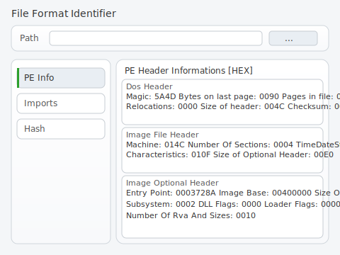
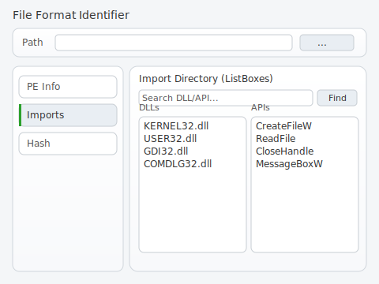
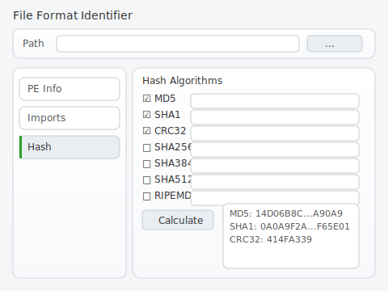

# 产品需求文档（精简美化版，保留框选功能）

## 文档信息
- 项目：PE 单界面分析工具（精简美化版）
- 版本：v1.1
- 视觉基线：仅保留截图中框选区域的功能，像素级还原并优化视觉（允许±2像素）

## 界面设计图
（已统一采用“左侧Tab三页设计”，历史单界面图已废弃）

## 左侧Tab三页设计（新增）
- 顶部路径工具栏 + 左侧纵向导航 + 右侧卡片内容区
- 设计图：
  - 
  - 
  - 
  - 
- Tab 与内容页说明：
  - 左侧导航（`PE Info`、`Imports`、`Hash`），选中项高亮与左侧选中条
  - `PE Info`：扩展展示 DOS Header / Image File Header / Optional Header 关键字段（不含任何按钮），并保留 `Entry Point/Image Base/Size Of Image/SubSystem/Number Of Rva And Sizes`
  - `Imports`：右侧卡片为“搜索栏 + 左/右两个列表框（DLLs / APIs）”；搜索支持按 DLL/API 关键字过滤与高亮
  - `Hash`：右侧卡片为“多算法勾选 + Calculate + 结果区域”；默认勾选 `MD5/SHA1/CRC32`，其余算法可选
- 视觉规范：圆角卡片、浅分隔、统一间距；DPI=100%、`Segoe UI 9pt`、像素容忍度≤±2px

## 界面总览
- 标题：`File Format Identifier v1.5.3`
- 客户区尺寸：基准 480×280，DPI=100%（96 DPI），字体 `Segoe UI 9pt`
- 保留的功能与区域：
  - 顶部路径区：`Path:`、路径编辑框、`...`、`Dir...`
  - Identifier 信息区：`Entry Point (RVA/RAW)`、`EP Section`（含 `>`）、`First Bytes`（含 `>`）、`Linker Info.`、`SubSystem`
  - 信息块：`MD5` 与 `Notice` 提示
- 移除：右侧纵列按钮与底部按钮行，仅保留框选区域的核心信息与操作
- 美化：圆角卡片、浅色分隔与阴影、统一 8px/16px 间距，保持 Win32 标准控件风格

## 控件与资源ID
- 顶部路径区：`IDC_LABEL_PATH`、`IDC_EDIT_PATH`、`IDC_BTN_BROWSE`（删除 `IDC_BTN_DIR_TOP`）
- Identifier 信息区：
  - 左列：`IDC_LABEL_EP_RVA/IDC_EDIT_EP_RVA`、`IDC_LABEL_EP_RAW/IDC_EDIT_EP_RAW`、`IDC_LABEL_LINKER_INFO/IDC_EDIT_LINKER_INFO`
  - 右列：`IDC_LABEL_EP_SECTION/IDC_EDIT_EP_SECTION`、`IDC_LABEL_FIRST_BYTES/IDC_EDIT_FIRST_BYTES`、`IDC_LABEL_SUBSYSTEM/IDC_EDIT_SUBSYSTEM`（删除两个 `>` 导航按钮）
- 信息块：`IDC_EDIT_MD5`、`IDC_EDIT_NOTICE`

## 坐标与尺寸（基准）
- 客户区：宽 480、高 280；四周外边距 16px；允许偏差 ≤ ±2px
- 顶部路径区：`Path` 标签 `(28,58)`；编辑框 `(70,44,W≈270,H≈20)`；`...` `(346,44,W≈28,H≈20)`；`Dir...` `(380,44,W≈68,H≈20)`
- Identifier：矩形 `(16,84,W≈448,H≈116)`；两列字段，行高≈20、行距≈8；右列 `>` 按钮靠右对齐
- 信息块：矩形 `(16,206,W≈448,H≈56)`；单行 MD5 与单行 Notice（超长换行）

## 数据解析规则
- `Entry Point(RVA)`：`OptionalHeader.AddressOfEntryPoint`（十六进制 `0x` 前缀）
- `Entry Point(RAW)`：`RVAToFileOffset(AddressOfEntryPoint)`
- `EP Section`：包含该 RVA 的节名（`IMAGE_SECTION_HEADER.Name`）
- `First Bytes`：自 RAW 读取前 4–8 字节（大写十六进制、逗号分隔）
- `Linker Info`：`MajorLinkerVersion.MinorLinkerVersion`
- `SubSystem`：`OptionalHeader.Subsystem` 映射为 `Win32 GUI/Windows CUI/Native`
- `MD5`：全文件 MD5（十六进制大写）
- `Notice`：Overlay 检测（末段 RawEnd < 文件大小）与提示文案

## 交互行为
- `...`：打开文件对话框并刷新全部字段
- 拖拽：拖入文件自动填充 `Path` 并解析
- 已移除：目录打开与 `>` 导航相关交互

## 错误与状态
- 非 PE 或读取失败：信息块显示错误并清空字段
- 越界/RVA→RAW 失败：显示失败点与原因
- 操作反馈：信息块或状态区输出成功/失败

## 性能与质量
- 解析普通 PE ≤200ms；大型文件显示进度或提示
- 静态分析零阻断错误；编译零警告（或显式屏蔽）

## 验收与测试
- 像素还原：控件位置与尺寸匹配美化版设计图与截图基线，偏差 ≤ ±2px
- 功能流程：文件选择→解析→字段填充；拖拽加载可用
- 用例：有效 PE/非 PE/有 overlay/拖拽；全部通过

## 交付物与变更说明
- 交付：VS2022 解决方案与资源文件（单界面）、构建脚本、测试报告与验收记录
- 变更：移除右侧纵列按钮与底部按钮行，仅保留框选的核心区域功能

## 技术约束
- 平台与工具链
  - Visual Studio 2022（MSVC v143），Windows 10 SDK。
  - 解决方案平台：Win32 与 x64；默认 Release 静态运行时 `/MT`，Debug 使用 `/MTd`。
- 依赖与链接库
  - 系统库：`kernel32/user32/gdi32/comctl32/shell32/advapi32/ole32/comdlg32/crypt32`。
  - 不使用 Qt/wxWidgets/MFC 等第三方 GUI 框架。
- 资源编译
  - `*.rc` 资源包含菜单与图标，确保 `resource.h` ID 与资源文件一致。
- 编码与国际化
  - 源文件统一保存为 UTF-8；界面文案中文；避免代码页警告。

## 性能与质量
- 性能目标：与原工程相比性能下降不超过 5%。
- 覆盖率目标：行覆盖率 ≥ 90%，分支覆盖率 ≥ 85%。
- 静态分析：零阻断级错误；编译零警告（或全部消除/屏蔽无害项）。
- 兼容性：Win32 与 x64 构建均功能一致；Windows 10/11。

## 安全与稳定性
- 不处理不受信任数据时崩溃；对越界读取、无效 RVA 等进行健壮校验。
- 不记录敏感信息；不暴露密钥或用户隐私。
- 哈希计算对大输入进行渐进或提示，避免 UI 僵死。

## 验收标准
- 功能接口与视觉完全兼容原工程，像素偏差 ≤ ±2。
- 所有测试用例通过率 100%。
- 构建无编译警告与静态分析错误。
- 文档与交付物完整：解决方案、构建脚本、测试报告、覆盖率与性能数据、部署指南、差异分析。

## 里程碑与交付物
- 里程碑
  - 第 1 周：环境配置、工程分析、PRD 完成与评审。
  - 第 2 周：解决方案迁移、单元测试与界面自动化框架打通。
  - 第 3 周：测试完善与覆盖率/静态分析达标、性能基准与调优。
  - 第 4 周：CI 稳定、文档与差异报告完善、验收与交付。
- 交付物
  - VS2022 解决方案（Win32/x64）、构建脚本（含 clean/build/package）。
  - 测试报告（含覆盖率与性能数据）、部署指南、差异分析报告。

## 测试要求概述
- 冒烟测试：主窗口创建、菜单可用、Tab/TreeView 显示与基本交互。
- 界面自动化：消息驱动与 UI Automation 组合；断言控件树、可见性与文本内容。
- 截图回归：固定 DPI/主题/字体生成基线；像素差异比对与阈值报告。
- 非 UI 单测：解析与算法模块采用 GoogleTest；集成 `ctest` 或 MSBuild 测试运行。

## 风险与注意事项
- 64 位 PE 解析的扩展：当前解析逻辑针对 32 位，可在后续里程碑扩展到 64 位（`IMAGE_NT_HEADERS64`）。
- 大型 PE 文件的读取性能：需要分页或优化内存映射（视需求）。
- UI 不稳定因素：DPI/主题/语言差异导致截图比对波动，需在 CI 固定环境参数。

## 代码参考
- 入口点：`c:\project\petools\PEAnalyzer.cpp:45`
- 菜单资源：`c:\project\petools\PEAnalyzer.rc:5`
- 资源 ID：`c:\project\petools\resource.h:1`
- 导入表解析：`c:\project\petools\PEParser.cpp:93`、`c:\project\petools\PEParser.cpp:116`
- 哈希计算触发：`c:\project\petools\PEAnalyzer.cpp:387`
